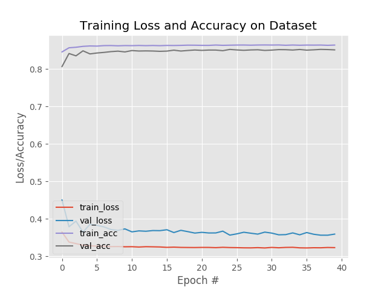
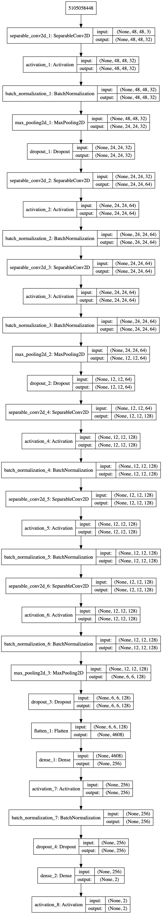

# Breast Cancer Detect using Deep Lerning 
> Deep learning repository for trainng and dataset building       > pipelines for breast cancer detection
## Project Description 
In India and over the world, Cancer has become a deadly disease and more and more people are suffering from Cancer and a survey says one in every 30 women suffer from this disease in their lifetime and so basically the project was first thought of because of the increase in cases of breast cancer and one thing which is very important that if we can detect the Cancer at an early stage then there is an increased chances of it getting cured.So this project lays a foundation in making the detection of the cancer automated so that more and more people can get it diagonised early so as get cured.

Aruthor :- **Mahaveer Suthar"

## Final Results plot

## Project Structure 
project-tree
 - build_dataset.py     
 - cancernet_arch_raw.png
 - datasets                                                                     **# **Sample Dataset
 -  - idc
 - mahaveer
    - cancernet.py
    - config.py
    - __init__.py
    - __pycache__
 - output.log
 - plot.png
 - README.md
 - train_model.py
 
## Cancernet Model Architecture 

## Tools and Setup for this project
## Install virtual environment

## How to install virtualenv:

### Install **pip** first

    sudo apt-get install python3-pip

### Then install **virtualenv** using pip3

    sudo pip3 install virtualenv 

### Now create a virtual environment 

    virtualenv venv 

>you can use any name insted of **venv**

### You can also use a Python interpreter of your choice

    virtualenv -p /usr/bin/python3.6 venv
  
### Active your virtual environment:    
    
    source venv/bin/activate
    
### Using fish shell:    
    
    source venv/bin/activate.fish

### To deactivate:

    deactivate

### Create virtualenv using Python3
    virtualenv -p python3 myenv

### Instead of using virtualenv you can use this command in Python3
    python3 -m venv myenv

## Installation without sudo

curl https://bootstrap.pypa.io/get-pip.py | python3.6 - --user

This may sometimes give a warning such as:

    WARNING: The script wheel is installed in '/home/ubuntu/.local/bin' which is not on PATH. Consider adding this directory to PATH or, if you prefer to suppress this warning, use --no-warn-script-location.

### Verification

After this, pip, pip3, and pip3.6 can all be expected to point to the same target:

$ (pip -V && pip3 -V && pip3.6 -V) | uniq
pip 18.0 from /usr/local/lib/python3.6/dist-packages (python 3.6)

Of course you can alternatively use python3.6 -m pip as well.

$ python3.6 -m pip -V
pip 18.0 from /usr/local/lib/python3.6/dist-packages (python 3.6)

# Install virtualenvwrapper
pip3.6 install virtualenvwrapper

## Working!!
python3.6 -m virtualenv venv

## Install Tensorflow
$pip install --upgrade tensorflow	
$ pip install numpy scipy
$ pip install scikit-learn
$ pip install pillow
$ pip install h5py
pip install keras

sudo apt-get install python-scipy
or 
sudo pip3.6 install scipy --upgrade

# Install other tools
pip install numpy opencv-contrib-python
$ pip install pillow
$ pip install tensorflow keras
$ pip install imutils
